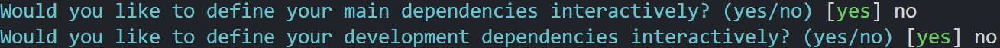
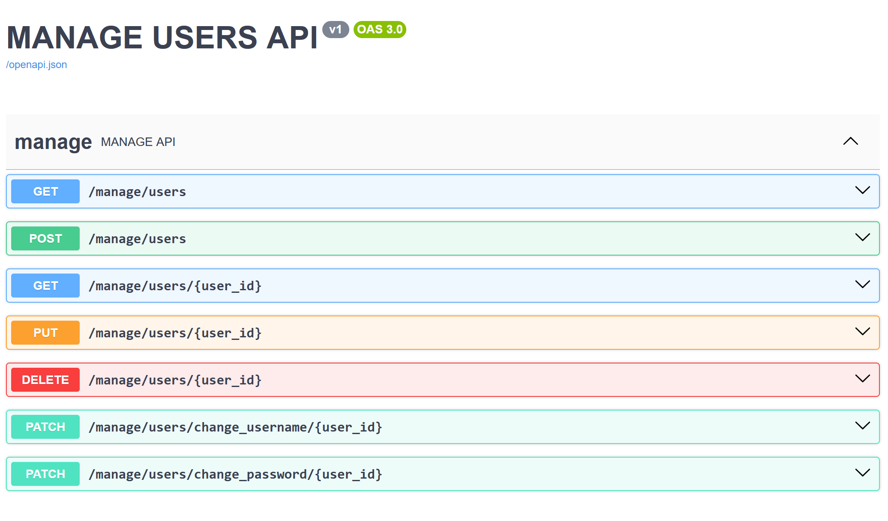

# Flask API

This is a basic example of a user management API using the python [Flask](https://flask.palletsprojects.com/en/stable/) framework and [Flask-smorest](https://flask-smorest.readthedocs.io/en/latest/). It is only meant as an illustration, without features needed for a production system, but the rough framework of the API is in place.
It is based on the structure in [this](https://www.youtube.com/watch?app=desktop&v=mt-0F_5KvQw) microapis tutorial, and has been augmented to function as a user management API. 

## Environment and dependencies

You will need [Python3](https://www.python.org/downloads/), [pip](https://pypi.org/project/pip/) and [venv](https://packaging.python.org/en/latest/guides/installing-using-pip-and-virtual-environments/) already installed in your environment.

### Set-up steps

Within your project folder create your python virtual environment:
```bash
python3 -m venv .venv
```
Activate the virtual environment:
```bash
source .venv/bin/activate
```
Install poetry:
```bash
pip install -U setuptools
pip install poetry
```
Initiate poetry environment (using default settings is fine):
```bash
poetry init
```

Say no to  these options:
<p align="left">
  
</p>

Install dependencies:
```bash
poetry add flask flask-smorest
```

## The API

The app code is split into three files:
| File | description |
|:------------|:----------|
| app.py | `Main code for the configuration of the API and the definitions of the API routes.` |
| models.py   | `Python classes that define the data schema for the API.` |
| data.py    | `In memory list to represent user data.` |

### API configuration

The first part of the **app.py** file handles the basic configuration of the API.

First create an instance of the Flask object:
```python
server = Flask(__name__)
```

Create a class for the API config, and pass the config to the Flask server. The **OPENAPI_SWAGGER_UI** attributes configure the app to create a management interface for the API, at the **/docs** endpoint, using the [swagger-ui](https://swagger.io/tools/swagger-ui/) framework:
```python
class APIConfig:
    API_TITLE = "TODO API"
    API_VERSION = "v1"
    OPENAPI_VERSION = "3.0.3"
    OPENAPI_URL_PREFIX = "/"
    OPENAPI_SWAGGER_UI_PATH = "/docs"
    OPENAPI_SWAGGER_UI_URL = "https://cdn.jsdelivr.net/npm/swagger-ui-dist/"

server.config.from_object(APIConfig)
```

Create an instance of the API object using flask-smorest:
```python
api = Api(server)
```

Create blueprints (collections of url paths that belong together):
```python
todo = Blueprint("todo", "todo", url_prefix="/todo", description="TODO API")
```

### Define routes

The rest of the code in **app.py** defines the logic for the API collection and singleton endpoints.

A standard use-case with API endpoints is that they will handle multiple http methods (GET, POST, PUT, DELETE), and we need to handle those methods with different function definitions. The approach here is to use classes to group multiple http methods for the same Url endpoint.

To enable a class to represent a route, we create a class that inherits from Flask **MethodView**. This allows the creation of views that represent Urls as classes.
```python
class TodoCollection(MethodView): 
```

We then model http endpoints as methods of that class:
```python
def get(self, parameters):
    # endpoint logic goes here
```

the ```@todo.arguments```, and ```@todo.response``` decorator functions allow you to define the schema of the input and output data for the API endpoints.


```@todo.arguments``` decorator defines the arguments schema for the API input data. Arguments are received as a http payloads by default, but can be passed as query parameters if specified using ```location="query"```:
```python
@todo.arguments(ListUserParameters, location="query")
```

```@todo.response``` decorator defines the status-code and the schema for the response data.
```python
@todo.response(status_code=200, schema=UsersList)
```

The schemas for argument and response data are defined in **models.py** as python classes using the **marshmallow** package. The classes inherit from the ```Schema``` class. The data types of each argument/response are defined as class attributes using the ```field``` method:
```python
class User(Schema): 
    id = fields.UUID()
    created = fields.DateTime()
    username = fields.String()
    password = fields.String()
```

### Running the API

With the virtual environment activated and the dependencies installed, run the app using:
```bash
FLASK_APP=app:server flask run --reload
```
Flask runs a development server on **localhost:5000** by default. To access API Swagger management interface, hit the ```localhost:5000/docs``` endpoint in a browser.

You should be presented with this Swagger management interface:
<p align="left">
  
</p>


